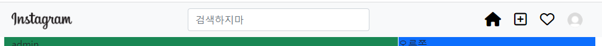

# README.md

### 04.19.

 

ERD model 구상

django-admin으로 project 생성


### 04.20.

- model 구현

  - ERD를 기반으로, accounts의 User모델과 articles의 모델들을 만들어주었다.

- base.html 만들기

  - bootstrap을 적용시키고, navbar를 복사 붙여넣기 해놓았다.

- settings.py

  - INSTALLED_APPS에 imagekit 추가

  ```
  AUTH_USER_MODEL = 'accounts.User'
  
  MEDIA_URL = '/media/'
  
  MEDIA_ROOT = BASE_DIR / 'media'
  
  STATIC_URL = '/static/'
  
  STATICFILES_DIRS = [BASE_DIR / 'static']
  ```

  - 위 속성들을 추가해주었다.

- gstagram/urls.py

  ```
  urlpatterns = [
      path('admin/', admin.site.urls),
      path('', include('articles.urls')),
  ] + static(settings.MEDIA_URL, document_root=settings.MEDIA_ROOT)
  ```

  - media의 경로를 추가해줬다.

- 기본 프사 추가

  - static/accounts에 default_profile.jpg를 넣어두었다.


### 04.21.

- 네비게이션 바 생성 (base.html)
  - 왼쪽 instagram 사진과 중간의 검색창, 오른쪽의 아이콘 4개를 배치했다.
  - 아이콘은 font-awesome을 이용했다. 이거 사용할 때 script를 마지막에 쓰는거 잊지말기
  - min-width: 650px으로 창이 작아졌을 때 아이콘이 wrap되는 현상을 방지함
  - max-width: 975px으로 적당한 크기로 사진과 검색창, 아이콘이 배치되도록 함

 

- 피드 기초작업 (index.html)

  - justify-content-center, justify-content-lg-start로 일정 크기 이상에선 article이 왼쪽에 가도록 하고, 작아지게 되면 중앙으로 오도록 했다.

  ```html
    <div class="d-none d-lg-block position-fixed bg-primary" style="height:200px; width:325px; left:50%; transform: translate(163px, 0);">
  ```

  - d-none, d-lg-block으로 lg이상의 크기일때만 오른쪽 내 정보가 표시되도록 했다.
  - style에서 left, transform을 통해서 알맞은 위치에 내 정보가 위치하도록 했다. position-fixed를 적용하면 상대위치를 참조할 수가 없어서 이렇게 했다.